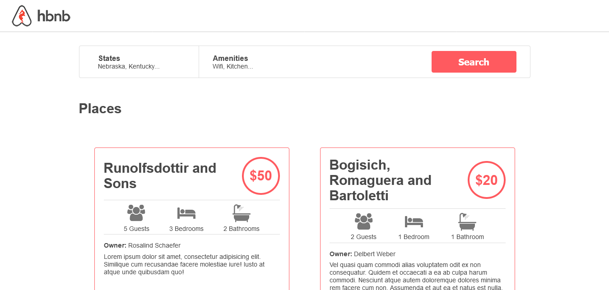

# AirBnB_clone - static web

## Description

A static web version of the future Holberton AirBnB project. This means there's only an HTML and CSS frontend with no Javascript or backend connection whatsoever. The purpose of this project is to practice HTML and CSS development. Here's a short description of the files.

- 0-index.html: A reed header and a green footer with the text "Holberton School".
- 1-index.html: A reed header and a green footer with the text "Holberton School".
- 2-index.html, 2-common.css, 2-header.css, 2.footer.css: A red header and a green footer with the text "Holberton School".
- 3-index.html, 3-common.css, 3-header.css, 3-footer.css: Header with the hbnb logo and white footer with the text "Holberton School".
- 4-index.html, 4-common.css, 3-header.css, 3-footer.css: From 3, search bar implementation.
- 5-index.html, 4-common.css, 3-header.css, 3-footer.css, 5-filters: From 4, search bar with options implementation.
- 6-index.html, 4-common.css, 3-header.css, 3-footer.css, 6-filters: From 5, search bar with options implementation and dropdown.
- 7-index.html, 4-common.css, 3-header.css, 3-footer.css, 6-filters, 7-places.css: From 6, 3 places with its names.
- 8-index.html, 4-common.css, 3-header.css, 3-footer.css, 6-filters, 8-places.css: From 7, 3 places with its names and some information.
- 100-index.html, 4-common.css, 3-header.css, 3-footer.css, 6-filters, 100-places.css: From 8, 3 places with its names and more information.
- 101-index.html, 4-common.css, 3-header.css, 3-footer.css, 6-filters, 101-places.css: From 100, usage of flexbox to the places articles.
- 102-index.html, 102-common.css, 102-header.css, 102-footer.css, 102-filters, 102-places.css: From 101, implementation of a responsive design.
- 103-index.html, 103-common.css, 103-header.css, 103-footer.css, 103-filters, 103-places.css: From 102, implementation of some accessibility elements in mind.

---

## Screenshot of final version

---

## Authors

* **Alfredo Delgado Moreno** - [AlfredPianist](https://github.com/AlfredPianist)